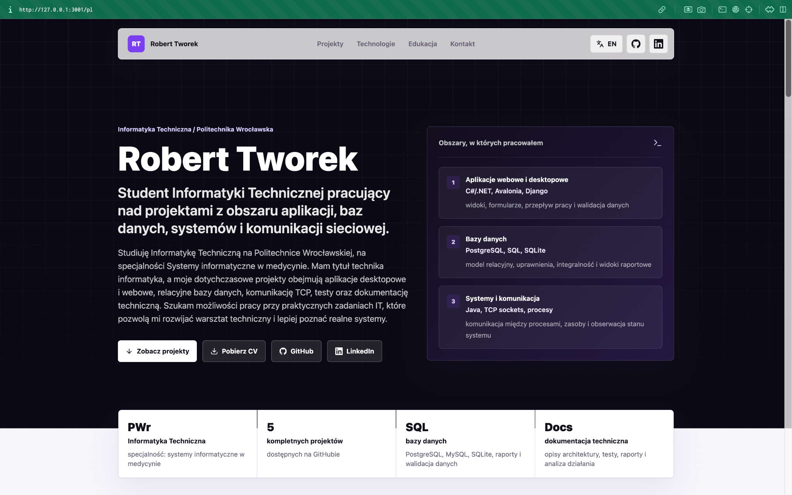
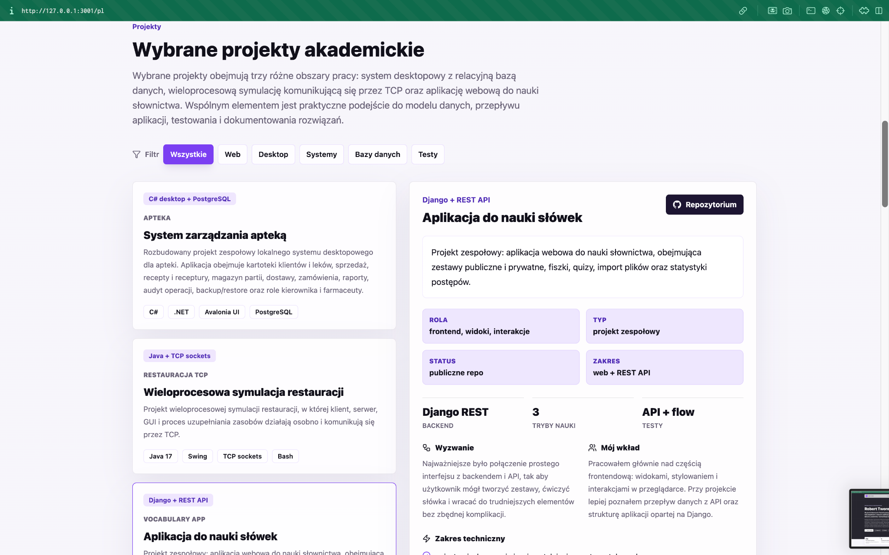
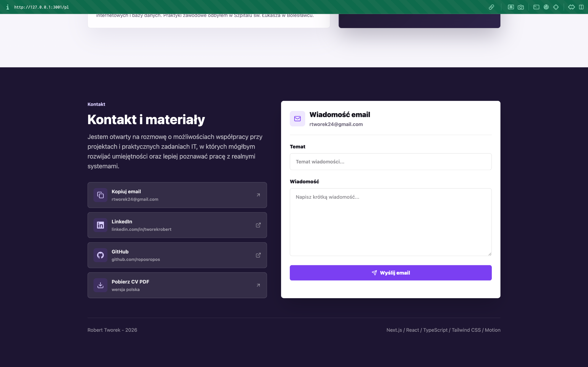

# Robert Tworek Portfolio


A modern bilingual portfolio website created as a recruitment-oriented project and a central place for presenting my academic work, technical background, CV and contact information.

The website presents selected projects from areas such as desktop applications, web applications, relational databases, TCP communication, testing and technical documentation. It also includes a live GitHub project index, language switching, CV download and a simple email composer.

> This is a personal portfolio and academic showcase project. It is not a commercial product or a production service.

## Author

- Robert Tworek

## Screenshots

### Home section



### Projects section



### Contact section



## Features

- Polish and English versions available under `/pl` and `/en`
- responsive portfolio hero with CV, GitHub and LinkedIn actions
- selected project case studies with filters and detailed technical descriptions
- dynamic GitHub repository counter and public repository index
- expanded pharmacy management system case study based on project documentation
- technology groups, education timeline and work-strengths panel
- contact section with email copy, external links, CV download and mail composer
- SEO metadata, sitemap, robots route, OpenGraph image and custom favicon
- consistent violet visual style matching my CV and GitHub profile

## What the project shows

| Area | What it demonstrates |
| --- | --- |
| Frontend structure | Next.js App Router, React components, reusable content data and responsive layout |
| TypeScript | typed content model, typed GitHub API response handling and safer component props |
| UI implementation | project filters, interactive case-study cards, contact form state and language switching |
| GitHub integration | public repository count and repository list fetched from the GitHub API |
| Recruitment presentation | structured project descriptions, CV links, contact paths and bilingual content |
| Deployment readiness | environment variables, metadata base URL, sitemap, robots and production build scripts |

## Tech stack

- Next.js App Router
- React
- TypeScript
- Tailwind CSS
- Motion
- Lucide React
- GitHub REST API

## Project structure

```text
app/                 Next.js routes, metadata, sitemap, robots and API routes
components/          main portfolio experience component
data/                bilingual portfolio content
lib/                 helpers for GitHub API and class names
public/              CV files, screenshots and visual assets
```

## Environment variables

Create `.env.local` from `.env.example` when running the project locally.

```bash
NEXT_PUBLIC_SITE_URL=http://localhost:3000
GITHUB_TOKEN=
```

`NEXT_PUBLIC_SITE_URL` is used for metadata, sitemap and OpenGraph URLs.

`GITHUB_TOKEN` is optional. Without it, the site still works, but GitHub API requests use the lower public rate limit.

## Getting started

```bash
pnpm install
pnpm dev
```

Open:

```text
http://localhost:3000/pl
```

or:

```text
http://localhost:3000/en
```

## Quality checks

```bash
pnpm typecheck
pnpm lint
pnpm build
```

## Deployment

The project is ready for a standard Next.js deployment target such as Vercel, Netlify or a Node-compatible server.

For deployment, set:

```bash
NEXT_PUBLIC_SITE_URL=https://your-production-domain.example
GITHUB_TOKEN=optional_github_token
```

Vercel supports Next.js with zero-configuration deployment and can connect directly to a Git repository. After deployment, the production URL can be added to the repository description, GitHub profile README and CV.

## Repository description

Suggested GitHub repository description:

```text
Personal bilingual portfolio website built with Next.js, React, TypeScript and Tailwind CSS.
```

Suggested repository topics:

```text
nextjs react typescript tailwindcss portfolio personal-website github-api bilingual
```
